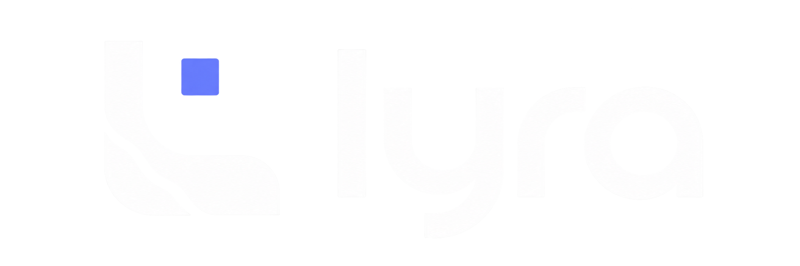
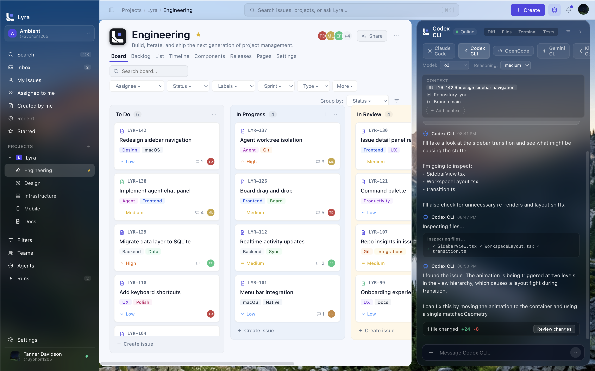
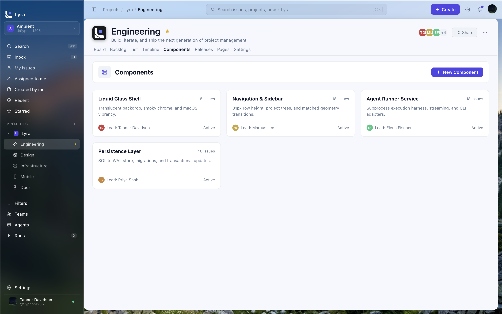
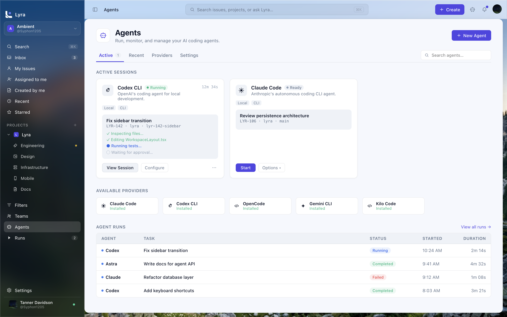
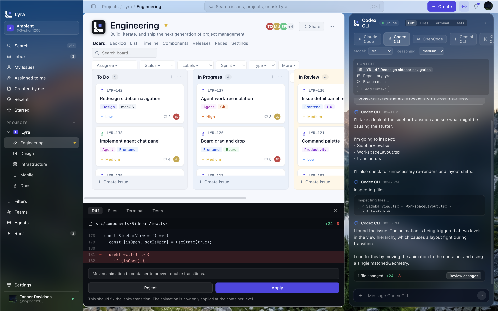

<div align="center">

  <a href="https://github.com/Syphon1205/Lyra">
    <picture>
      <source media="(prefers-color-scheme: dark)" srcset="assets/Lyra-Long.png">
      <source media="(prefers-color-scheme: light)" srcset="assets/Lyra-Long-dark.png">
      
    </picture>
  </a>

  <br />
  <br />

  <p><strong>The Project Management Cockpit for Humans & Coding Agents</strong></p>

  <p><em>A calm, blazingly fast alternative to Jira and Linear built natively for macOS — featuring deep CLI coding agent integration, local-first SQLite persistence, and liquid glass vibrancy.</em></p>

[](https://apple.com/macos)
[](https://www.electronjs.org/)
[](https://react.dev/)
[](https://www.typescriptlang.org/)
[-003B57?logo=sqlite&style=flat-square)](https://github.com/WiseLibs/better-sqlite3)
[](https://claude.ai/code)
[](LICENSE)

[Features](#-key-features) • [Visual Tour](#-visual-tour) • [Architecture](#-architecture--design-system) • [Getting Started](#-getting-started) • [Shortcuts](#-keyboard-shortcuts) • [Contributing](#-contributing)

</div>

---

## 🌟 Overview

Modern software engineering teams do not work alone anymore — they collaborate directly with autonomous coding agents like **Claude Code**, **Codex**, and **Gemini**. Yet legacy project trackers (Jira, Linear, Asana) treat software development as a humans-only endeavor, forcing developers to constantly copy-paste requirements, switch windows, manually execute CLI agents in external terminals, and context-switch across disconnected tools.

**Lyra bridges this divide.**

Lyra is a native-feeling macOS application that pairs Jira-grade project management (epics, backlogs, sprints, Kanban boards, estimation points, and issue hierarchies) with a real-time **coding agent cockpit**. In Lyra, agents are first-class team members: they can be assigned to issues, run inside isolated Git worktrees, stream their tool executions live into a docked companion chat, and submit structured code diffs for human review.

All of this is wrapped in a meticulously crafted macOS interface adhering to a strict **Liquid Glass Material Contract** — combining deep smoky translucent navigation, pale frosted toolbars, and high-performance local SQLite storage.

---

## ✨ Key Features

- 📋 **Full-Featured Kanban Board**: Fluid multi-column workflow (To Do, In Progress, In Review, Done) powered by Atlassian's Pragmatic Drag and Drop, featuring rich issue cards, labels, priority markers, and assignee avatars.
- 🔄 **Sprint Planning & Agile Cycles**: Manage sprints with duration tracking, velocity metrics, point estimation rollups, and effortless drag-and-drop backlog triage.
- 🤖 **Autonomous Coding Agent Cockpit**: Native execution of CLI coding agents (including Claude Code via `claude -p --output-format stream-json`). Inspect active runs, resource usage, duration, and agent logs in real time.
- 💬 **Live Companion Agent Chat**: A docked, translucent assistant panel operating alongside your issues and boards. Stream tokens, watch bash tools and file updates execute live, and provide follow-up steering.
- 🌳 **Git Worktree Isolation**: Lyra executes agent runs inside dedicated, clean Git worktrees (`.lyra/worktrees/`). Agents can experiment, modify files, and run test suites without ever dirtying your current working branch.
- 📝 **In-Context Diff & Code Review**: Inspect agent code modifications directly within the workspace. View side-by-side or unified diffs with syntax highlighting, and approve (`Apply`) or `Reject` changes with one click.
- ⚡ **Raycast-Style Command Palette (⌘K)**: Instant fuzzy navigation across issues, projects, cycles, recent items, and quick actions without taking your hands off the keyboard.
- 🪟 **macOS Liquid Glass Material System**: Built on Electron 33 `under-window` native vibrancy, featuring dark translucent sidebars, pale toolbars, and scoped solid workspaces that never bleed into glass surfaces.
- 💾 **Local-First SQLite Persistence**: High-throughput embedded SQLite database (`better-sqlite3`) ensures zero network latency, instant search, and complete offline capability.

---

## 📸 Visual Tour

### 1. First-Run Onboarding Experience
*Zero-friction startup wizard configuring local SQLite WAL storage, agent CLI discovery, and GitHub CLI authorization.*


Lyra's onboarding flow prepares your environment in seconds:
- **Local-First SQLite Storage**: Initializes high-performance WAL-mode persistence for zero latency and offline resilience.
- **First-Class AI Coding Agents**: Automatically discovers installed agent CLI binaries (`claude`, `codex`, `gemini`, `opencode`, `kilo`).
- **GitHub CLI Backbone**: Leverages your active system `gh` authentication without asking for personal access tokens.

---

### 2. Interactive Kanban Board
*Effortless task orchestration with Pragmatic Drag and Drop, instant multi-attribute filtering, and a live docked agent companion.*



The board view provides a high-density, calm overview of your project's active cycle. Cards display priority indicators (`Low`, `Medium`, `High`), issue keys, customizable tags (`Design`, `macOS`, `Agent`, `Git`), and assignee avatars. The right side features a seamless, dark-translucent agent companion panel docked alongside the project canvas.

---

### 3. Deep Issue Inspection & Detail View
*Comprehensive issue metadata, Markdown previews, task checklists, branch linking, and an audit trail.*


Every issue in Lyra is rich with context:
- **Task Checklists**: Track progress with interactive completion checkboxes.
- **Git & Worktree Integration**: Directly link active branches (`lyr-142-sidebar`), view commit counts, pull requests, and file change statistics (+24 -8).
- **One-Click Agent Delegation**: Click **"Run with Agent"** or **"Start worktree"** to spin up an agent session pre-loaded with the issue's requirements.
- **Unified Activity Timeline**: Audit comments, commit hashes, status changes, and agent execution events in a single chronologically sorted feed.

---

### 4. Sprint Planning & Agile Backlog
*Prioritize cycles, manage sprint velocity, and track estimation points with zero friction.*


Organize multi-week cycles (e.g., *Cycle 04*), monitor sprint completion percentages, and drag issues between the active sprint and the backlog. Columns display issue keys, descriptions, assignees, priorities, and estimated delivery times.

---

### 5. Sprint Roadmap & Timeline View
*Gantt-style timeline visualization for cross-functional sprint planning and milestone delivery schedules.*


Track milestone timelines and active sprint progress across your engineering roadmap:
- **Cycle Visualization**: Inspect active cycle progress bars (e.g., *Cycle 04 · 68% Complete*) alongside upcoming planned sprints.
- **Duration Scheduling**: Track estimation windows and delivery schedules for individual features and tasks.
- **Cross-Team Alignment**: Align engineering work with planned release milestones across calendar weeks.

---

### 6. Architecture & Subsystem Components
*Modular breakdown of project subsystems, tracking ownership, active issue distribution, and health metrics.*



Structure complex codebases into maintainable subsystem components:
- **Component Cards**: Visualize core layers such as *Liquid Glass Shell*, *Navigation & Sidebar*, *Agent Runner Service*, and *Persistence Layer*.
- **Ownership & Status**: Assign component leads (`Tanner Davidson`, `Marcus Lee`, `Elena Fischer`, `Priya Shah`) and monitor active component statuses.
- **Issue Distribution**: Audit issue counts associated with each architecture module to quickly locate hotspots.

---

### 7. Releases & Milestone Tracking
*Version release management tracking shipped milestones, active release candidate progress, and planned versions.*


Track the lifecycle of every Lyra version:
- **Release Statuses**: Monitor `In Progress`, `Released`, and planned targets.
- **Completion Meters**: Real-time progress bars showing completion percentage and resolved issue ratios (e.g., *12 of 16 issues completed*).
- **Changelog Association**: Link issues, feature notes, and agent commits directly to target semver release tags.

---

### 8. Living Documentation & Project Pages
*In-app Markdown knowledge base and architecture documentation directly adjacent to your backlog and board.*


Maintain your team's living technical documentation without context-switching to third-party wikis:
- **Project Wiki**: Author and organize technical documentation directly alongside code issues.
- **Architecture Guides**: Document system principles, design contracts, and developer onboarding steps.
- **Markdown Support**: Full formatting capabilities with quick delete, edit, and cross-linking capabilities.

---

### 9. Agent Cockpit & Fleet Management
*Run, monitor, and coordinate your AI coding agents across multiple local repositories.*



The Agent Cockpit gives engineering leads and individual developers complete observability over their agent workforce:
- **Active Sessions**: Monitor live agent execution status (`Running`, `Idle`), elapsed time, and real-time step progress (*Inspecting files...*, *Editing WorkspaceLayout.tsx*, *Running tests...*).
- **Available Providers**: Plug-and-play CLI adapters for Claude Code, OpenAI Codex CLI, Gemini CLI, OpenCode, and Kilo CLI.
- **Historical Runs**: Comprehensive ledger of past agent runs, execution durations, start times, and outcomes (`Completed`, `Failed`).

---

### 10. Real-Time Companion Agent Chat
*Streaming tool executions, terminal monitoring, and multi-file code generation docked at your side.*


The agent chat panel is anchored to your active project or issue:
- **Context Awareness**: Displays active issue key, repository name, and target branch.
- **Streaming Execution**: Visualizes tool calls as discrete, legible cards (e.g., inspecting files, executing bash commands, running linters).
- **Diff Notification**: Automatically prompts with diff stats and a **"Review changes"** button when the agent finishes authoring code.

---

### 11. In-Context Diff & Code Review
*Inspect syntax-highlighted git diffs with instant Apply or Reject controls before merging.*



Never blindly trust agent code edits. Lyra parses git patch outputs and displays an interactive, color-coded diff review right inside the chat drawer. Review modified lines, read the agent's explanation for the changes, and click **Apply** to write the patch to your branch or **Reject** to revert.

---

### 12. Raycast-Style Command Palette (⌘K)
*Instant keyboard-first navigation for every corner of your workspace.*


Press `⌘K` anywhere in Lyra to trigger the command palette. Rapidly create new issues (`⌘N`), dispatch prompts to agents (`⌘⇧A`), switch between projects (`⌘P`), run project builds (`⌘B`), search the repository (`⇧⌘F`), or jump between navigation views.

---

### 13. Settings & Liquid Glass Material Engine
*Fine-tune macOS vibrancy, accent colors, layout density, and agent CLI bindings.*


Customize Lyra to match your exact desktop workflow:
- **Material Appearance**: Choose between Light, Dark, or System appearances.
- **Glass Effects Toggle**: Enable or disable desktop wallpaper translucency through sidebars and panels.
- **Accessibility Modes**: Full support for system **Reduce Motion** and **Increase Contrast** preferences.
- **Density Controls**: Adjust layout spacing between *Compact*, *Default*, and *Comfortable*.
- **Live Wallpaper Preview**: Real-time canvas simulation showing wallpaper transmission and border highlights.

---

## 🏛 Architecture & Design System

### The Strict Glass Material Contract

Lyra adheres to an explicit design contract documented in [`docs/glass-material-contract.md`](docs/glass-material-contract.md). Rather than relying on generic CSS blur filters, Lyra establishes rigorous paint boundaries:

```
AppShell [transparent]
├── WorkspaceSidebar [dark glass surface]
└── MainArea [transparent]
    ├── TopBar / Toolbar [pale translucent glass]
    └── WorkRow [transparent]
        ├── WorkspaceCanvas [solid cool-white surface: #F6F8FE]
        └── AgentPanel / Chat [matching dark glass surface]
```

#### Core Rules:
1. **Dark Navigation Stays Dark**: The navigation sidebar and agent panel maintain their deep smoky blue-gray tone (`rgb(30 43 61 / 0.36)`) even in light mode.
2. **Strictly Scoped Workspace Canvas**: The solid canvas surface ends strictly at the workspace boundary — it never bleeds underneath the sidebar or agent drawer.
3. **Four Explicit Material Modes**:
   - `native-vibrancy`: Production macOS mode utilizing Electron 33 `vibrancy: "under-window"` with `#00000000` background.
   - `css-preview`: Development and browser sandbox mode using CSS `backdrop-filter: blur(28px)`.
   - `solid-accessibility`: High-contrast solid fallback when system **Reduce Transparency** is detected.
   - `solid-unsupported`: Safe solid fallbacks for unsupported platforms.
4. **Automated Contract Tests**: Lyra includes a dedicated test suite (`npm test`) that validates token values, surface scopes, and accessibility rules before every release.

---

### Technology Stack

| Layer | Technology | Purpose |
|---|---|---|
| **Runtime** | [Electron 33](https://www.electronjs.org/) | macOS `under-window` vibrancy, multi-window management, secure IPC |
| **Frontend** | [React 18](https://react.dev/) + [TypeScript 5](https://www.typescriptlang.org/) | Component hierarchy, type safety, modular design system |
| **Bundler** | [Vite 6](https://vitejs.dev/) | Sub-second HMR and optimized production builds |
| **State Management**| [Zustand 5](https://github.com/pmndrs/zustand) | Lightweight, performant reactive state and store synchronization |
| **Persistence** | [Better-SQLite3](https://github.com/WiseLibs/better-sqlite3) | Synchronous, embedded, local-first database with WAL mode |
| **Drag and Drop** | [@atlaskit/pragmatic-drag-and-drop](https://atlassian.design/components/pragmatic-drag-and-drop/) | High-performance Kanban column & issue card reordering |
| **Table Virtualization** | [@tanstack/react-table](https://tanstack.com/table/v8) + [Virtual](https://tanstack.com/virtual/v3) | Virtualized list views capable of handling thousands of issues |
| **Agent CLI Runner** | Node Child Process / PTY | Streaming JSON protocol parser for Claude Code & CLI agents |
| **Testing** | [Vitest](https://vitest.dev/) | Unit testing & automated Glass Material Contract validation |

---

## 🚀 Getting Started

### Prerequisites

- **macOS**: 14 (Sonoma), 15 (Sequoia), or later (Apple Silicon or Intel)
- **Node.js**: 20.x or higher
- **npm**: 10.x or higher
- *(Optional)* [Claude Code CLI](https://claude.ai/code) installed globally on your machine:
  ```bash
  npm install -g @anthropic-ai/claude-code
  ```

### Installation

1. **Clone the repository**:
   ```bash
   git clone https://github.com/Syphon1205/Lyra.git
   cd Lyra/app
   ```

2. **Install dependencies**:
   ```bash
   npm install
   ```

3. **Run the contract test suite**:
   ```bash
   npm test
   ```

4. **Launch Lyra in development mode**:
   ```bash
   npm run dev:electron
   ```
   *This starts the Vite renderer server with Hot Module Replacement and launches the Electron application with native macOS vibrancy enabled.*

---

## 🔨 Build & Packaging

To compile and package Lyra into a standalone macOS application bundle:

```bash
cd app

# 1. Typecheck renderer and main processes
npm run typecheck

# 2. Build production renderer bundle & Electron preload
npm run build

# 3. Package macOS application (outputs to app/release/mac-arm64)
npm run package
```

---

## ⌨️ Keyboard Shortcuts

| Shortcut | Action |
|---|---|
| <kbd>⌘</kbd> <kbd>K</kbd> | Open Command Palette |
| <kbd>⌘</kbd> <kbd>N</kbd> | Create New Issue |
| <kbd>⌘</kbd> <kbd>P</kbd> | Switch Project |
| <kbd>⌘</kbd> <kbd>⇧</kbd> <kbd>A</kbd> | Focus Agent Companion Chat |
| <kbd>⌘</kbd> <kbd>B</kbd> | Toggle Navigation Sidebar |
| <kbd>⌘</kbd> <kbd>/</kbd> | Toggle Agent Chat Drawer |
| <kbd>⌘</kbd> <kbd>1</kbd> | Switch to Board View |
| <kbd>⌘</kbd> <kbd>2</kbd> | Switch to Backlog View |
| <kbd>⌘</kbd> <kbd>3</kbd> | Switch to List View |
| <kbd>⌘</kbd> <kbd>,</kbd> | Open Settings |
| <kbd>Esc</kbd> | Close Modal / Command Palette / Active Panel |

---

## 📂 Repository Structure

```
Lyra/
├── .github/
│   ├── ISSUE_TEMPLATE/     # Bug report & feature request templates
│   ├── workflows/          # GitHub Actions CI configuration
│   └── pull_request_template.md
├── app/                    # Primary application source
│   ├── electron/           # Main process, SQLite database & IPC services
│   │   ├── main.ts         # Window management & lifecycle
│   │   ├── preload.ts      # Secure context bridge API
│   │   └── services/       # IssueService, GitService, ClaudeAdapter, Catalog
│   ├── src/                # React 18 frontend
│   │   ├── components/     # Board, Backlog, IssueDetail, Agents, Chat, DiffReview
│   │   ├── state/          # Zustand global stores
│   │   └── styles/         # CSS tokens & Liquid Glass styling
│   └── shared/             # Shared TypeScript types & IPC channels
├── assets/                 # Brand marks and app icons
├── docs/                   # Architecture specs & Glass Material Contract
├── screenshots/            # High-resolution application screenshots
├── CONTRIBUTING.md         # Developer setup & PR guidelines
├── CODE_OF_CONDUCT.md      # Contributor Covenant
├── SECURITY.md             # Vulnerability disclosure policy
├── LICENSE                 # MIT License
└── README.md               # You are here
```

---

## 🤝 Contributing

Contributions to Lyra are welcome! Please read [CONTRIBUTING.md](CONTRIBUTING.md) for instructions on coding standards, contract testing, and the pull request submission process.

---

## 🛡 Security

If you discover a security vulnerability within Lyra, please review [SECURITY.md](SECURITY.md) for disclosure guidelines. Please do not open public issues for sensitive security flaws.

---

## 📄 License

Lyra is open-source software licensed under the [MIT License](LICENSE).

---

<div align="center">
  <sub>Crafted with care by Tanner Davidson & the Ambient community.</sub>
</div>
